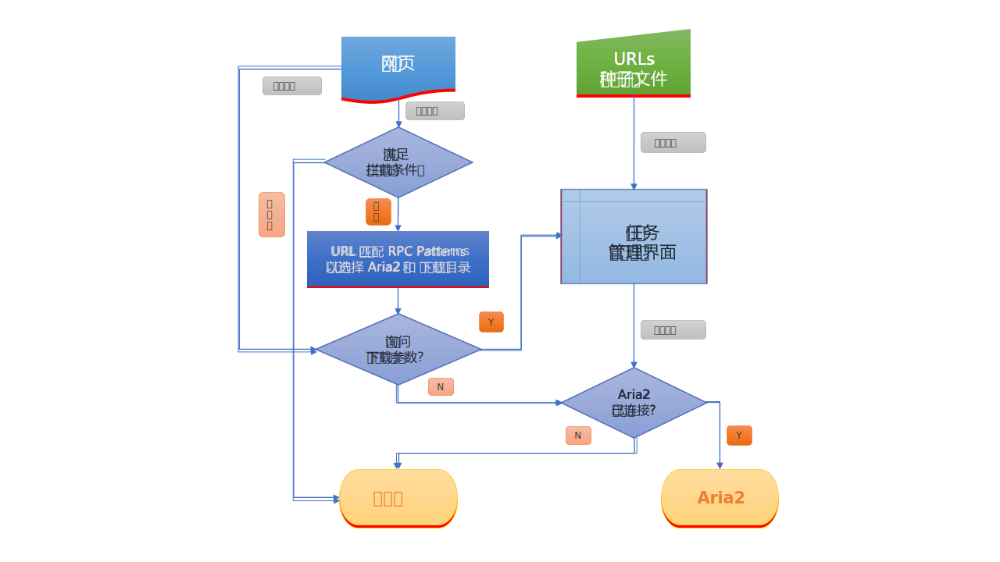

# Aria2 Explorer <span style="float:right">[[返回]](README.md)</span>

**Aria2 Explorer** 是一款为 Chrome 定制的下载任务管理扩展，能够自动拦截或手动添加下载任务到 Aria2 来完成网络资源下载。同时，引入了 [AriaNG](https://www.github.com/mayswind/AriaNg/) 作为前端，方便用户对 Aria2 进行操作和管理。

## 📑 如何使用

1. Windows系统请下载 <span style="vertical-align:middle;">[](https://github.com/alexhua/aria2-manager/)</span>，其他系统请下载 Aria2 主程序：<span style="vertical-align:middle;">[](https://github.com/aria2/aria2/releases)</span>
2. Windows系统请运行 **Aria2Manager.exe** ，其他系统，请打开 **Terminal** 输入 `aria2c --enable-rpc`
3. 从[在线商店](#-安装地址)安装浏览器扩展
4. 在扩展选项中打开 `自动拦截下载`，并根据需求配置其他选项

完成后，既可在Chrome中享受高速下载体验。

## ⭐ 功能特性

1. 自动拦截浏览器下载任务

    - 拦截通知
    - 支持磁力链接
    - 快捷键开关自动拦截 (默认：<kbd>Alt</kbd>+<kbd>A</kbd>)
    - 下载前手动设置各种详细参数
    - 通过域名、扩展名或文件大小过滤下载任务
    > 过滤优先级：网站 > 扩展名 > 文件大小，优先处理白名单

2. 根据预设URL规则匹配下载URL来自动选择不同的 Aria2 RPC 服务端和下载目录

3. 内置 Aria2 前端：AriaNG **增强版**。多种呈现方式：弹窗，新标签，新窗口，侧边栏

4. 所有配置（扩展和AriaNG）云端同步

5. 中/日/韩/英/法/意/俄/乌/西班牙/捷克多语言支持

6. Aria2下载状态监测和任务状态通知

7. 右键菜单批量导出网页资源（图片·音频·视频·磁力链接）

8. 接受来自其他扩展的Aria2下载请求

9. 选项配置页面快捷键（保存：<kbd>Alt</kbd>+<kbd>S</kbd> 重置：<kbd>Alt</kbd>+<kbd>R</kbd> 下载：<kbd>Alt</kbd>+<kbd>J</kbd> 上传：<kbd>Alt</kbd>+<kbd>U</kbd>）

10. 支持当没有连接Aria2时，通过浏览器下载网络链接

## 🧩 外部调用

允許其他擴展使用這個擴展作為與 Aria2 的中介軟體來下載檔案。  

```js

const downloadItem = {
    url: "https://sample.com/image.jpg",
    filename: "image_from_sample.jpg",
    referrer: "https://sample.com",
    options: { 
        split: "10", // aria2 RPC options here
        xxxxx: "oooo"
    }
}

chrome.runtime.sendMessage(`Aria2-Explorer extension ID`, downloadItem)

```

## 🔀 流程图



## 📥 安装地址

[](https://chrome.google.com/webstore/detail/mpkodccbngfoacfalldjimigbofkhgjn "Aria2 Explorer")
[](https://microsoftedge.microsoft.com/addons/detail/oldmglcdbdhmdmmcdmglddihokifobhn "Aria2 Explorer")

## 💡 常见问题

[https://github.com/alexhua/aria2-explorer/issues?q=label:faq](https://github.com/alexhua/aria2-explorer/issues?q=label%3AFAQ)

## 🔒 隐私政策

本扩展会拦截浏览器下载任务和相关 Cookies 信息，发送到用户指定的 Aria2 服务端来完成下载。Aria2 连接和配置信息会保存在本地或者由用户选择上传到用户登录的云端进行存储。本扩展不会收集任何用户个人信息或网络活动记录，也不会帮助任何第三方收集用户信息。

## 📜 开源协议


Aria2-Explorer is licensed under [BSD 3-Clause License](https://opensource.org/license/bsd-3-clause/).
