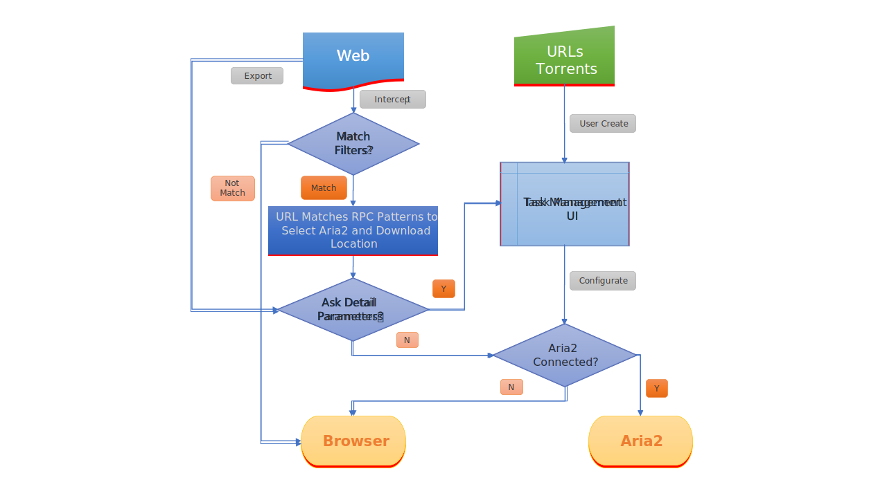

# Aria2 Explorer <span style="float:right">[[中文]](README.cn.md)</span>

**Aria2 Explorer** is an extension that could export URLs to Aria2 to complete downloads and imports [AriaNG](https://www.github.com/mayswind/AriaNg/) as a built-in management frontend.

## 📑How to use

Procedures:

1. For Windows, please download <span style="vertical-align:middle;">[](https://github.com/alexhua/aria2-manager/)</span>. Other platform, please download Aria2 utility: <span style="vertical-align:middle;">[](https://github.com/aria2/aria2/releases)</span>
2. For Windows, please run **Aria2Manager.exe**. Other platform, please run Aria2 in the **Terminal** with typing `aria2c --enable-rpc`.
3. Install extension from [web store](#-installation).
4. Enable `auto-capture` on the extension options page and configure others as you need.

After completing these steps, the extension will take over the download process, leading you to a high-speed download experience.

## ⭐ Features

1. Auto capture browser download tasks
    - Capture notification
    - Support magnet links
    - Toggle auto-capture by shortcut (Default: <kbd>Alt</kbd>+<kbd>A</kbd>)
    - Configure each Aria2 option manually before download
    - Filter intercepted task by the domain, file extensions or file sizes
    > Filter priority: domain > file-ext > file-size, white-list > black-list
2. Auto-select Aria2 RPC server and download location by matching downloading URL with preset URL pattern

3. Built-in Aria2 frontend: AriaNG **Enhanced Version**. Multiple present styles: popup, new tab, new window, side panel

4. Synchronize and store all the settings (extension and AriaNG) on the cloud

5. Support for zh-CN/zh-TW/en/fr/ja/ko/ru/uk languages

6. Monitor Aria2 download status via extension badge icon

7. Batch export webpage resources (Image·Audio·Video·Magnet) links from context menu

8. Receive Aria2 download requests from other extensions

9. Support shortcuts in the options page (Save:<kbd>Alt</kbd>+<kbd>S</kbd> Reset:<kbd>Alt</kbd>+<kbd>R</kbd> Download:<kbd>Alt</kbd>+<kbd>J</kbd> Upload:<kbd>Alt</kbd>+<kbd>U</kbd>)

10. Support downloading URLs via browser automatically if aria2 is disconnected

## 🧩 Integration

Allow other extensions to use this extension as middleware to download files with Aria2.

```js

const downloadItem = {
    url: "https://sample.com/image.jpg",
    filename: "image_from_sample.jpg",
    referrer: "https://sample.com",
    options: { 
        split: "10", // aria2 RPC options here
        xxxxx: "oooo"
    }
}

chrome.runtime.sendMessage(`Aria2-Explorer extension ID`, downloadItem)

```
## 🔀 Flow Chart



## 📥 Installation

[](https://chrome.google.com/webstore/detail/mpkodccbngfoacfalldjimigbofkhgjn "Aria2 Explorer")
[](https://microsoftedge.microsoft.com/addons/detail/jjfgljkjddpcpfapejfkelkbjbehagbh "Aria2 Explorer")

## 💡 Tips & FAQs

[https://github.com/alexhua/aria2-explorer/issues?q=label:faq](https://github.com/alexhua/aria2-explorer/issues?q=label%3AFAQ)

## 🔒 Privacy policy

This extension just captures download tasks and related website cookies from the user's browser for the purpose of connecting to the user's Aria2 server to download the network resources. Any connection and configuration information for Aria2 will be stored locally or can be optionally uploaded to the user's logged-in cloud. This extension does not collect any personal data or network activity from the user, nor will it share any such data with 3rd parties.

## 📜 License


Aria2-Explorer is licensed under [BSD 3-Clause License](https://opensource.org/license/bsd-3-clause/).
